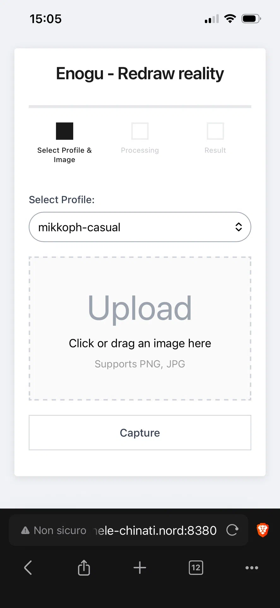

# Enogu - Redraw Reality

> **Note** This project is vibecoded using RooCode backed by Qwen3.5-35B-A3B via Lemonade. It is an experiment to assess coding capabilities of this model in my current setup. It also happens to scratch an itch I had an am having lots of fun using it but that doesn't mean that it will be useful to you. It does nothing that you couldn't do using ComfyUI + your favorite LLM tool alone.

A web application that processes uploaded images through an LLM for analysis and generates new images via ComfyUI integration. The application supports multiple profiles for different generation configurations. The profile is made of a ComfyUI workflow and a prompt to send to the LLM together with the reference image in order to produce the image generation prompt. By playing with this "extraction" prompt you can have the LLM generate interesting prompts, which makes the whole thing quite fun to use.

## Features

- Image upload and analysis using LLM with tool calling
- Automatic prompt extraction from uploaded images
- Image generation via ComfyUI workflows
- Multiple profile support for different configurations
- Custom aspect ratio selection (1:1, 4:3, 16:9, 20:9 in portrait/landscape)
- Upscaling support with configurable resolution (1x, 2x, 4x)
- Image history (last 10 generated images)
- Re-analyze and regenerate capabilities
- CORS-enabled API for flexible frontend integration
- Mobile-friendly with camera capture support

## Demo



## Prerequisites

- Python 3.10 or higher
- [uv](https://github.com/astral-sh/uv) package manager (recommended)
- ComfyUI server running with appropriate workflows
- LLM API access

## Installation

Using `uv` (recommended):

```bash
uv sync
```

This will create a virtual environment and install all dependencies defined in `pyproject.toml`.

## Configuration

### Global Configuration

Create a `config.json` file in the project root (use `config.template.json` as a starting point):

```json
{
    "server": {
        "host": "0.0.0.0",
        "port": 8380
    },
    "providers": {
        "comfyui_endpoint": "http://localhost:8188",
        "llm_endpoint": "http://localhost:8000/api/v1",
        "llm_apikey": "your-api-key",
        "llm_model": "user.Qwen3.5-35B-A3B-NoThinking"
    }
}
```

### Profile Configuration

Each profile is stored in the `profiles/` directory. Each profile directory should contain:

- `extraction_prompt.txt` - Prompt template for image analysis
- `workflow.json` - ComfyUI workflow definition
- `mappings.json` - Parameter mappings for dynamic workflow configuration

The `mappings.json` file allows you to map parameters like `prompt`, `seed`, `resolution`, `upscaler_switch`, and `upscale_resolution` to specific nodes in the workflow by their node IDs.

## Running the Application

```bash
uv run python app.py
```

The server will start on `http://localhost:8380` (or the port specified in `config.json`).

## API Endpoints

- `GET /` - Serves the frontend application
- `GET /api/profiles` - Lists all available profiles
- `POST /api/analyze` - Analyzes an uploaded image and returns a generation prompt
  - `file`: UploadFile - The image to analyze
  - `profile`: str - Profile name to use
  - Returns: `{"success": true, "prompt": "..."}` or error
- `POST /api/generate` - Generates an image from a prompt using ComfyUI
  - `prompt`: str - The generation prompt
  - `profile`: str - Profile name to use
  - `width`: int (default: 1024) - Image width
  - `height`: int (default: 1024) - Image height
  - `seed`: int (default: -1) - Random seed (-1 for random)
  - `upscale_switch`: bool (default: false) - Enable upscaling
  - `upscale_resolution`: int (default: 1024) - Upscaled resolution
  - Returns: `{"success": true, "image": "data:image/png;base64,..."}` or error

## Frontend Features

- **Profile Selection**: Choose from available profiles
- **Image Upload**: Drag-and-drop or click to upload images
- **Mobile Camera**: Direct camera capture on mobile devices
- **Aspect Ratio Selection**: Choose from predefined ratios (1:1, 4:3, 16:9, 20:9)
- **Upscaling**: Optional upscaling with configurable resolution
- **Image History**: View last 10 generated images
- **Re-analyze**: Re-run LLM analysis on the same image
- **Regenerate**: Generate a new image with the same prompt

## Dependencies

- **FastAPI** - Async web framework for the API
- **Uvicorn** - ASGI server
- **Requests** - HTTP client for calling LLM and ComfyUI APIs
- **Pillow** - Image manipulation and resizing
- **python-multipart** - Handling file uploads in forms

## Project Structure

```
imagegen/
├── app.py              # Main FastAPI application
├── config.json         # Global configuration (created from config.template.json)
├── config.template.json # Configuration template
├── pyproject.toml      # Project dependencies
├── .gitignore          # Git ignore rules
├── frontend/           # Static frontend files
│   ├── index.html      # Main HTML page
│   ├── app.js          # Frontend JavaScript logic
│   └── styles.css      # CSS styling
└── profiles/           # Profile configurations
    └── <profile_name>/ # Individual profile directories
        ├── extraction_prompt.txt  # LLM analysis prompt
        ├── workflow.json    # ComfyUI workflow definition
        └── mappings.json    # Parameter mappings
```

## License

MIT
