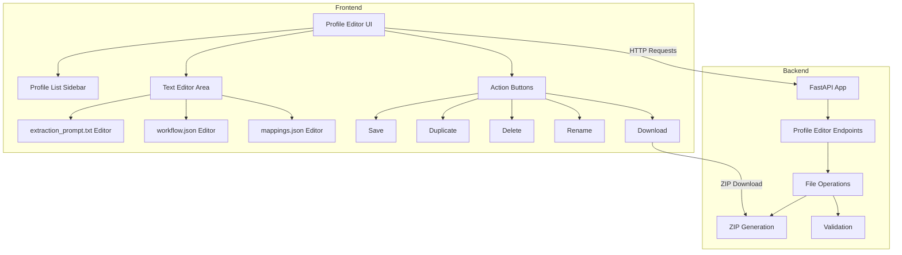

# Profile Editor Feature - Architecture Plan

## Overview

This document outlines the implementation of a profile editor feature for the Enogu application. The editor will allow users to:
- View and edit profile files (extraction_prompt.txt, workflow.json, mappings.json)
- Duplicate existing profiles with new names
- Delete profiles
- Rename profiles
- Download individual profiles or all profiles as ZIP files

## Architecture Diagram



## API Endpoints

### 1. List All Profiles
```
GET /api/profile-editor/profiles
Response: [{"name": "profile1"}, {"name": "profile2"}, ...]
```

### 2. Get Profile Content
```
GET /api/profile-editor/profile/{profile_name}
Response: {
    "name": "profile_name",
    "extraction_prompt": "text content",
    "workflow": {...json...},
    "mappings": {...json...}
}
```

### 3. Save/Update Profile
```
POST /api/profile-editor/profile
Body: {
    "name": "profile_name",
    "extraction_prompt": "text content",
    "workflow": {...json...},
    "mappings": {...json...}
}
Response: {"status": "success", "message": "Profile saved"}
```

### 4. Duplicate Profile
```
POST /api/profile-editor/profile/duplicate
Body: {
    "source_name": "existing_profile",
    "new_name": "new_profile_name"
}
Response: {"status": "success", "message": "Profile duplicated"}
```

### 5. Delete Profile
```
DELETE /api/profile-editor/profile/{profile_name}
Response: {"status": "success", "message": "Profile deleted"}
```

### 6. Rename Profile
```
POST /api/profile-editor/profile/rename
Body: {
    "old_name": "old_profile_name",
    "new_name": "new_profile_name"
}
Response: {"status": "success", "message": "Profile renamed"}
```

### 7. Download Single Profile
```
GET /api/profile-editor/download/{profile_name}
Response: ZIP file containing extraction_prompt.txt, workflow.json, mappings.json
```

### 8. Download All Profiles
```
GET /api/profile-editor/download-all
Response: ZIP file containing all profile directories
```

## Backend Implementation Details

### Helper Functions to Add

```python
import shutil
import zipfile
import tempfile
from fastapi.responses import FileResponse, JSONResponse

def validate_profile_name(name: str) -> bool:
    """Validate profile name to prevent directory traversal."""
    import re
    # Allow only alphanumeric, hyphens, and underscores
    return bool(re.match(r'^[a-zA-Z0-9_-]+$', name))

def get_profile_files(profile_name: str) -> dict:
    """Read all files from a profile directory."""
    profile_path = PROFILES_DIR / profile_name
    
    files = {}
    for filename in ["extraction_prompt.txt", "workflow.json", "mappings.json"]:
        filepath = profile_path / filename
        if filepath.exists():
            with open(filepath, 'r') as f:
                files[filename] = f.read()
        else:
            files[filename] = None
    
    return files

def save_profile_files(profile_name: str, files: dict) -> None:
    """Save all files to a profile directory."""
    profile_path = PROFILES_DIR / profile_name
    profile_path.mkdir(parents=True, exist_ok=True)
    
    for filename, content in files.items():
        if content is not None:
            filepath = profile_path / filename
            with open(filepath, 'w') as f:
                f.write(content)

def delete_profile(profile_name: str) -> None:
    """Delete a profile directory."""
    profile_path = PROFILES_DIR / profile_name
    if profile_path.exists():
        shutil.rmtree(profile_path)

def rename_profile(old_name: str, new_name: str) -> None:
    """Rename a profile directory."""
    old_path = PROFILES_DIR / old_name
    new_path = PROFILES_DIR / new_name
    shutil.move(str(old_path), str(new_path))

def duplicate_profile(source_name: str, new_name: str) -> None:
    """Duplicate a profile directory with a new name."""
    source_path = PROFILES_DIR / source_name
    dest_path = PROFILES_DIR / new_name
    shutil.copytree(str(source_path), str(dest_path))

def create_profile_zip(profile_name: str) -> str:
    """Create a ZIP file for a single profile."""
    temp_file = tempfile.NamedTemporaryFile(delete=False, suffix='.zip')
    profile_path = PROFILES_DIR / profile_name
    
    with zipfile.ZipFile(temp_file.name, 'w', zipfile.ZIP_DEFLATED) as zipf:
        for filepath in profile_path.iterdir():
            zipf.write(filepath, filepath.name)
    
    return temp_file.name

def create_all_profiles_zip() -> str:
    """Create a ZIP file containing all profiles."""
    temp_file = tempfile.NamedTemporaryFile(delete=False, suffix='.zip')
    
    with zipfile.ZipFile(temp_file.name, 'w', zipfile.ZIP_DEFLATED) as zipf:
        for profile_dir in PROFILES_DIR.iterdir():
            if profile_dir.is_dir():
                for filepath in profile_dir.iterdir():
                    zipf.write(filepath, f"{profile_dir.name}/{filepath.name}")
    
    return temp_file.name
```

## Frontend Implementation Details

### UI Layout

```mermaid
graph LR
    subgraph Profile Editor Page
        A[Header: Profile Editor] --> B[Main Container]
        B --> C[Sidebar]
        B --> D[Editor Panel]
        C --> C1[Profile List]
        C --> C2[New Profile Button]
        D --> D1[Tabs: extraction_prompt | workflow | mappings]
        D --> D2[Text Area Editor]
        D --> D3[Action Buttons Row]
    end
```

### Key UI Components

1. **Profile List Sidebar**
   - Scrollable list of all profiles
   - Click to select and load profile
   - Highlight selected profile
   - "Duplicate" button next to each profile

2. **Editor Panel**
   - Three tabs for the three file types
   - Text area for extraction_prompt.txt
   - Code editor-style text area for JSON files
   - Syntax highlighting for JSON (optional)

3. **Action Buttons**
   - Save: Save current profile
   - Duplicate: Open dialog to duplicate profile
   - Delete: Delete current profile with confirmation
   - Rename: Open dialog to rename profile
   - Download: Download current profile as ZIP
   - Download All: Download all profiles as ZIP

### JavaScript Functions to Add

```javascript
// Profile Editor State
let currentProfile = null;
let profileData = {
    extraction_prompt: '',
    workflow: {},
    mappings: {}
};

// Load profile list
async function loadProfileEditorProfiles() {
    const response = await fetch('/api/profile-editor/profiles');
    const profiles = await response.json();
    // Render profile list
}

// Load profile content
async function loadProfileContent(profileName) {
    const response = await fetch(`/api/profile-editor/profile/${encodeURIComponent(profileName)}`);
    profileData = await response.json();
    // Update editor tabs
}

// Save profile
async function saveProfile() {
    const payload = {
        name: currentProfile,
        extraction_prompt: document.getElementById('extractionPromptEditor').value,
        workflow: JSON.parse(document.getElementById('workflowEditor').value),
        mappings: JSON.parse(document.getElementById('mappingsEditor').value)
    };
    await fetch('/api/profile-editor/profile', {
        method: 'POST',
        headers: {'Content-Type': 'application/json'},
        body: JSON.stringify(payload)
    });
}

// Duplicate profile
async function duplicateProfile() {
    const newName = prompt('Enter new profile name:');
    if (!newName) return;
    await fetch('/api/profile-editor/profile/duplicate', {
        method: 'POST',
        headers: {'Content-Type': 'application/json'},
        body: JSON.stringify({source_name: currentProfile, new_name: newName})
    });
}

// Delete profile
async function deleteProfile() {
    if (!confirm(`Delete profile "${currentProfile}"?`)) return;
    await fetch(`/api/profile-editor/profile/${encodeURIComponent(currentProfile)}`, {
        method: 'DELETE'
    });
}

// Rename profile
async function renameProfile() {
    const newName = prompt('Enter new profile name:');
    if (!newName) return;
    await fetch('/api/profile-editor/profile/rename', {
        method: 'POST',
        headers: {'Content-Type': 'application/json'},
        body: JSON.stringify({old_name: currentProfile, new_name: newName})
    });
}

// Download profile
function downloadProfile(profileName) {
    window.location.href = `/api/profile-editor/download/${encodeURIComponent(profileName)}`;
}

// Download all profiles
function downloadAllProfiles() {
    window.location.href = '/api/profile-editor/download-all';
}
```

## Security Considerations

1. **Profile Name Validation**
   - Only allow alphanumeric characters, hyphens, and underscores
   - Prevent directory traversal attacks

2. **JSON Validation**
   - Validate workflow.json and mappings.json before saving
   - Catch and report JSON parse errors

3. **File Size Limits**
   - Consider adding limits to prevent abuse

4. **Authentication** (Optional)
   - Consider adding basic authentication for the profile editor endpoints
   - Or restrict access to localhost only

## Implementation Order

1. Backend helper functions
2. Backend API endpoints
3. Frontend HTML structure
4. Frontend JavaScript logic
5. Frontend CSS styling
6. Testing and validation

## Notes

- The profile editor will be a separate page/screen accessible from the main UI
- JSON editors will use simple textarea elements (plain text editing as requested)
- ZIP downloads will use Python's zipfile module
- All operations will validate profile names to prevent security issues
